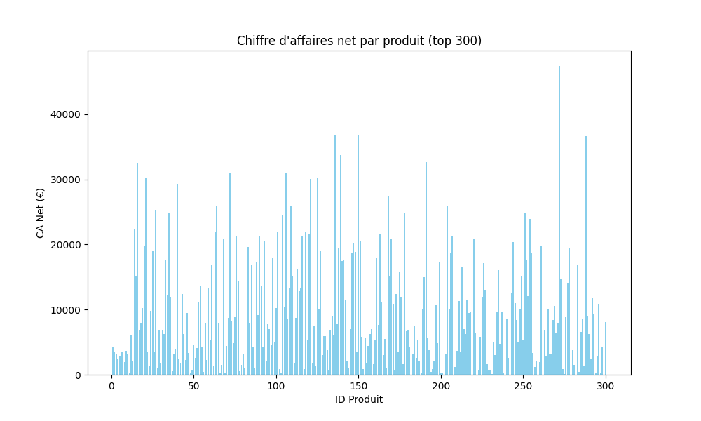

# Projet Ventes - PFA

## Description
Outil d'analyse de ventes automatisé pour le projet PFA. Ce programme permet d'analyser et d'évaluer les performances commerciales en calculant les chiffres d'affaires et en générant des rapports détaillés.

## Fonctionnalités principales

- **Lecture de données** : Import des données de ventes depuis un fichier CSV
- **Génération aléatoire** : Si l'utilisateur demande plus de produits que disponibles, le programme génère automatiquement des produits aléatoires
- **Calculs financiers** : 
  - Chiffre d'affaires brut (CA Brut = Prix × Quantité)
  - Chiffre d'affaires net après remise (CA Net)
  - Calcul de la TVA (20%)
- **Rapport détaillé** : Affichage d'un tableau récapitulatif par produit
- **Persistance des données** : Mise à jour du fichier `ventes.csv` avec les produits générés
- **Export des résultats** : Sauvegarde des analyses dans `resultats_final.csv`
- **Visualisation graphique** : Génération d'un graphique en barres du CA net par produit

## Comment utiliser ?

### 1. Préparer les données
Crée un fichier `ventes.csv` avec la structure suivante :
```
ID,Prix,Quantité,Remise
1,50.00,10,5
2,75.50,20,10
...
```

### 2. Lancer le programme
```bash
python main.py
```

### 3. Saisir le nombre de produits
Le programme demande : *"Combien de produits voulez-vous analyser ?"*
- Entrez un nombre ≥ 1
- Si le nombre dépasse les produits disponibles, des produits seront générés aléatoirement

## Fichiers d'entrée/sortie

| Fichier | Type | Description |
|---------|------|-------------|
| `ventes.csv` | Entrée/Sortie | Données des ventes (mis à jour avec les produits générés) |
| `resultats_final.csv` | Sortie | Rapport détaillé des analyses |
| `graphique.png` | Sortie | Graphique en barres du CA net |

## Colonnes du rapport

- **ID** : Identifiant du produit
- **Prix** : Prix unitaire (€)
- **Qté** : Quantité vendue
- **Remise** : Pourcentage de remise
- **CA Brut** : Chiffre d'affaires avant remise (€)
- **CA Net** : Chiffre d'affaires après remise (€)
- **TVA** : Taxe sur la valeur ajoutée 20% (€)

## Dépendances

- Python 3.x
- matplotlib (pour la génération de graphiques)

Installez matplotlib si nécessaire :
```bash
pip install matplotlib
```

## Exemple de graphique

